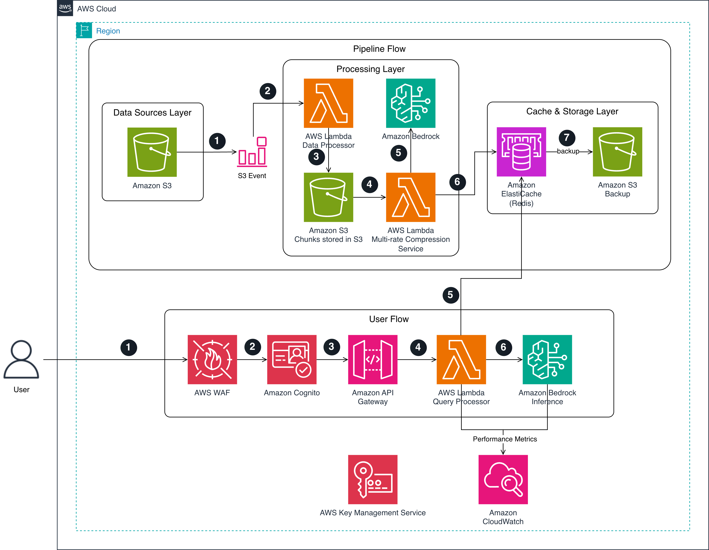

# Task-Aware Knowledge Compression (TAKC) on AWS

A Python-based implementation of Task-Aware Knowledge Compression for enterprise AI applications on AWS, enabling efficient reasoning over compressed knowledge representations using Amazon Bedrock.

## Overview

This solution implements the Task-Aware Knowledge Compression (TAKC) paradigm, providing:

- Task-specific knowledge compression at multiple rates (8×, 16×, 32×, 64×)
- Efficient query processing with compressed KV caches
- Scalable AWS infrastructure using AWS Lambda, Amazon Bedrock, and Amazon ElastiCache
- S3-based data ingestion with event-driven processing (extensible to other sources)
- Multiple LLM models via Amazon Bedrock (Claude 3, Llama 2, Titan)
- Data encryption at rest using AWS KMS with automatic key rotation

> **Note**: This is a reference implementation focused on demonstrating Task-Aware Knowledge Compression with basic security controls.
> 
> **Implemented:**
> - ✅ **Authentication**: Amazon Cognito User Pools with JWT token-based authorization
> - ✅ **API Security**: AWS WAF with rate limiting and managed security rules
> - ✅ **Encryption**: AWS KMS for data encryption at rest with automatic key rotation
> 
> **Not Implemented (enhance for production):**
> - **Amazon Bedrock Guardrails**: Content filtering, PII redaction, topic blocking
> - **Advanced Cognito Features**: MFA, email verification, self-service signup, social identity providers
> - **User Isolation**: Multi-tenancy and fine-grained data access controls

## Architecture



### Pipeline Flow (Data Ingestion & Compression)

**Step 1: S3 Upload**
- Raw data files are uploaded to Amazon S3 bucket under `raw-data/{task-type}/` prefix
- Example: `s3://takc-processed-data/raw-data/financial/data.txt`

**Step 2: S3 Event Trigger**
- S3 automatically generates an event notification when a new file is uploaded
- Event triggers the Data Processor Lambda function

**Step 3: Data Processing**
- AWS Lambda Data Processor reads the uploaded file
- Chunks the data into smaller segments (default: 256 tokens with 50-token overlap)
- Stores processed chunks to S3 at `s3://takc-processed-data/{task-type}/chunk_*.txt`

**Step 4: Multi-Rate Compression Invocation**
- Data Processor Lambda invokes the Multi-Rate Compression Service Lambda asynchronously
- Passes chunk location and task type information

**Step 5: Compression Generation**
- AWS Lambda Multi-Rate Compression Service reads all chunks from S3
- Calls Amazon Bedrock API to compress data at 4 different rates:
  - Ultra (64×): Maximum compression for simple queries
  - High (32×): Balanced compression for general use
  - Medium (16×): Moderate compression for complex reasoning
  - Light (8×): Minimal compression for critical accuracy
- **Note**: Bedrock Guardrails not implemented - add for content filtering/PII redaction if needed

**Step 6: Cache Storage**
- Compressed results stored in Amazon ElastiCache (Redis) with keys:
  - `takc:{task-type}:ultra`
  - `takc:{task-type}:high`
  - `takc:{task-type}:medium`
  - `takc:{task-type}:light`

**Step 7: Backup**
- Compressed caches backed up to Amazon S3 at `s3://takc-processed-data/cache/v2/{task-type}/{rate}/`
- All S3 data encrypted using AWS KMS (Customer Managed Key) with automatic key rotation

### User Flow (Query Processing)

**Step 1: User Authentication**
- User authenticates with Amazon Cognito User Pool using username and password
- Cognito validates credentials and returns JWT tokens (ID token, access token, refresh token)
- ID token is used for API authorization (valid for 1 hour)

**Step 2: User Query**
- User sends query request to the API endpoint with JWT token in Authorization header
- Request includes: query text, task type, optionally preferred compression rate, and `Authorization: Bearer <ID_TOKEN>`

**Step 3: AWS WAF Validation**
- Request first passes through AWS WAF for security checks
- WAF applies rate limiting (2000 requests per 5 minutes per IP)
- WAF blocks malicious requests using AWS Managed Rules (common threats, known bad inputs)
- Valid requests proceed to API Gateway

**Step 4: API Gateway & Cognito Authorization**
- Amazon API Gateway receives the request
- Cognito Authorizer validates the JWT token in the Authorization header
- Verifies token signature, expiration, and issuer
- If token is valid, request is routed to Query Processor Lambda
- If token is invalid, expired, or missing, returns 401 Unauthorized

**Step 5: Query Processing**
- AWS Lambda Query Processor analyzes query complexity
- Selects appropriate compression rate based on query requirements
- Retrieves compressed context from ElastiCache using key `takc:{task-type}:{rate}`

**Step 6: Cache Retrieval**
- Query Processor fetches the appropriate compressed cache from ElastiCache
- Falls back to S3 if cache miss occurs (ElastiCache not accessible without VPC)

**Step 7: Bedrock Inference**
- Query Processor sends compressed context + user query to Amazon Bedrock
- Bedrock generates response using the compressed knowledge
- **Note**: Bedrock Guardrails not configured - implement for production content safety

**Step 8: Response & Metrics**
- Response returned to user via API Gateway
- Performance metrics (latency, tokens used, compression ratio) logged to CloudWatch
- User can refresh token using refresh token when ID token expires (after 1 hour)

## Authentication & Authorization

**This implementation uses Amazon Cognito User Pools for authentication.**

The API requires a valid JWT token in the `Authorization` header for all requests. This provides:
- Industry-standard OAuth 2.0 / OpenID Connect authentication
- Secure JWT token-based authorization
- Built-in user management and password policies
- Token expiration and refresh capabilities (1-hour access tokens)

### Getting Started with Authentication

After deployment, you'll need to create users and obtain JWT tokens to access the API.

#### Step 1: Create a User

```bash
# Get User Pool ID from CDK outputs
USER_POOL_ID=$(aws cloudformation describe-stacks --stack-name TakcStack --query 'Stacks[0].Outputs[?OutputKey==`UserPoolId`].OutputValue' --output text)

# Create a user (admin-created, no self-signup)
aws cognito-idp admin-create-user \
  --user-pool-id $USER_POOL_ID \
  --username myuser \
  --temporary-password TempPass123! \
  --message-action SUPPRESS

# Set permanent password
aws cognito-idp admin-set-user-password \
  --user-pool-id $USER_POOL_ID \
  --username myuser \
  --password MySecurePass123! \
  --permanent
```

#### Step 2: Get JWT Token

```bash
# Get Client ID from CDK outputs
CLIENT_ID=$(aws cloudformation describe-stacks --stack-name TakcStack --query 'Stacks[0].Outputs[?OutputKey==`UserPoolClientId`].OutputValue' --output text)

# Authenticate and get JWT token
aws cognito-idp initiate-auth \
  --auth-flow USER_PASSWORD_AUTH \
  --client-id $CLIENT_ID \
  --auth-parameters USERNAME=myuser,PASSWORD=MySecurePass123! \
  --query 'AuthenticationResult.IdToken' \
  --output text
```

#### Step 3: Use Token in API Requests

```bash
# Get API endpoint
API_URL=$(aws cloudformation describe-stacks --stack-name TakcStack --query 'Stacks[0].Outputs[?OutputKey==`ApiEndpoint`].OutputValue' --output text)

# Get token
ID_TOKEN=$(aws cognito-idp initiate-auth \
  --auth-flow USER_PASSWORD_AUTH \
  --client-id $CLIENT_ID \
  --auth-parameters USERNAME=myuser,PASSWORD=MySecurePass123! \
  --query 'AuthenticationResult.IdToken' \
  --output text)

# Make authenticated request
curl -X POST ${API_URL}query \
  -H "Content-Type: application/json" \
  -H "Authorization: Bearer $ID_TOKEN" \
  -d '{"task_type": "financial", "query": "What are the key metrics?", "compression_rate": "medium"}'
```

### Token Management

- **Access Token Validity**: 1 hour
- **ID Token Validity**: 1 hour
- **Refresh Token Validity**: 30 days
- **Token Refresh**: Use the refresh token to obtain new access/ID tokens without re-authenticating

### For Production Deployments

This implementation provides a secure, production-ready authentication foundation. For enhanced security, consider:

- **Enable MFA**: Multi-factor authentication for additional security
- **Email Verification**: Verify user email addresses
- **Self-Service Signup**: Allow users to create their own accounts
- **Social Identity Providers**: Enable login with Google, Facebook, etc.
- **Advanced Security Features**: Enable Cognito advanced security features (risk-based authentication, compromised credentials detection)
- **Custom UI**: Build a custom login/signup UI for better user experience

## Amazon Bedrock Guardrails

**This reference implementation does not include Amazon Bedrock Guardrails.**

Amazon Bedrock Guardrails provide content filtering, PII redaction, topic blocking, and other safety controls. For production deployments handling sensitive data or requiring content moderation, you should implement Bedrock Guardrails based on your requirements:

- **Content Filters**: Block harmful content (hate speech, violence, sexual content, etc.)
- **Denied Topics**: Prevent responses on specific topics
- **Word Filters**: Block or redact specific words/phrases
- **PII Redaction**: Automatically detect and redact personally identifiable information
- **Contextual Grounding**: Ensure responses are grounded in provided context

This implementation focuses on demonstrating Task-Aware Knowledge Compression. Implement Bedrock Guardrails separately based on your content safety and compliance requirements.

## Why Amazon Bedrock?

- **Pay-per-Token Pricing**: Usage-based pricing model for variable workloads
- **Managed Service**: Reduces infrastructure management overhead with no endpoints to maintain
- **Multiple Models**: Provides access to Claude 3, Llama 2, and Titan model families
- **Enterprise Features**: Includes security and monitoring capabilities

## AWS Shared Responsibility Model

This implementation uses AWS services designed to help customers build secure and scalable applications. Security and compliance are shared responsibilities between AWS and customers:

### AWS Responsibilities (Security OF the Cloud):
- Infrastructure security for Amazon Bedrock, AWS Lambda, Amazon S3, and Amazon ElastiCache
- Service availability and data center physical security
- Network controls and host operating system patching

### Customer Responsibilities (Security IN the Cloud):
- Configuring services according to security requirements
- **Managing Cognito users and access policies** (this implementation provides basic authentication - enhance as needed)
- **Implementing Amazon Bedrock Guardrails** for content filtering, PII redaction, and safety controls
- Implementing appropriate access controls and user permissions
- Managing data encryption and KMS key policies
- Conducting regular security assessments
- Configuring MFA, email verification, and advanced security features in Cognito for production use

### Important Compliance Notes:
- Using AWS services does not automatically ensure compliance with specific regulations
- Customers should consult with compliance experts for their specific requirements
- Regular security assessments and monitoring are recommended
- This implementation provides basic Cognito authentication - enhance with MFA, email verification, and advanced security features for production
- **Amazon Bedrock Guardrails should be configured** for content safety and PII protection in production
- Implement proper user access controls and data isolation based on your requirements

## Quick Start

### Prerequisites

- AWS Account with appropriate permissions
- AWS CLI configured
- Python 3.9+
- Node.js (for AWS CDK)
- Amazon Bedrock model access (request via Bedrock Console if needed)

### Deployment

**Option 1: Using the deployment script (Recommended)**:
```bash
./scripts/deploy.sh
```

**Option 2: Manual CDK deployment**:
```bash
cd cdk

# Optional: Customize configuration
cp cdk.context.json.example cdk.context.json
# Edit cdk.context.json with your preferred settings

# Install dependencies
python3 -m venv .venv
source .venv/bin/activate
pip install -r requirements.txt

# Deploy (CDK automatically packages Lambda functions)
cdk bootstrap  # First time only
cdk deploy
```

3. **Create a Test User**:
   ```bash
   # Get User Pool ID and Client ID from deployment outputs
   USER_POOL_ID=$(aws cloudformation describe-stacks --stack-name TakcStack --query 'Stacks[0].Outputs[?OutputKey==`UserPoolId`].OutputValue' --output text)
   CLIENT_ID=$(aws cloudformation describe-stacks --stack-name TakcStack --query 'Stacks[0].Outputs[?OutputKey==`UserPoolClientId`].OutputValue' --output text)
   
   # Create user
   aws cognito-idp admin-create-user \
     --user-pool-id $USER_POOL_ID \
     --username testuser \
     --temporary-password TempPass123! \
     --message-action SUPPRESS
   
   # Set permanent password
   aws cognito-idp admin-set-user-password \
     --user-pool-id $USER_POOL_ID \
     --username testuser \
     --password Test123! \
     --permanent
   ```

4. **Get JWT Token**:
   ```bash
   # Authenticate and get token
   ID_TOKEN=$(aws cognito-idp initiate-auth \
     --auth-flow USER_PASSWORD_AUTH \
     --client-id $CLIENT_ID \
     --auth-parameters USERNAME=testuser,PASSWORD=Test123! \
     --query 'AuthenticationResult.IdToken' \
     --output text)
   
   echo "Token obtained successfully"
   ```

5. **Upload Test Data**:
   ```bash
   # Get S3 bucket name
   BUCKET_NAME=$(aws cloudformation describe-stacks --stack-name TakcStack --query 'Stacks[0].Outputs[?OutputKey==`DataBucketName`].OutputValue' --output text)
   
   # Upload sample data (triggers automatic compression)
   aws s3 cp tests/sample-financial-data.txt s3://${BUCKET_NAME}/raw-data/financial/sample.txt
   
   # Wait 2-3 minutes for compression to complete
   ```

6. **Query the System**:
   ```bash
   # Get API endpoint
   API_URL=$(aws cloudformation describe-stacks --stack-name TakcStack --query 'Stacks[0].Outputs[?OutputKey==`ApiEndpoint`].OutputValue' --output text)
   
   # Send authenticated query
   curl -X POST ${API_URL}query \
     -H "Content-Type: application/json" \
     -H "Authorization: Bearer $ID_TOKEN" \
     -d '{"task_type": "financial", "query": "What are the key financial metrics?", "compression_rate": "medium"}'
   ```

### Cleanup

To remove all AWS resources created by this project:

```bash
./scripts/destroy.sh
```

This script will:
- Empty and remove Amazon S3 buckets (including all versions and delete markers)
- Delete AWS Lambda functions and layers
- Remove Amazon API Gateway endpoints
- Delete Amazon ElastiCache instances
- Clean up all other AWS resources
- Verify successful resource removal
- Clean up local build artifacts

#### Prerequisites for Cleanup

The destroy script requires:
- AWS CLI configured with appropriate permissions
- Node.js and CDK CLI installed
- jq installed (for Amazon S3 bucket cleanup)

To install jq:
```bash
# macOS
brew install jq

# Ubuntu/Debian
sudo apt-get install jq

# CentOS/RHEL
sudo yum install jq
```

#### Safety Measures

The script will:
- Ask for confirmation before proceeding with resource removal
- Verify that resources have been properly removed
- Report any resources that failed to be removed

#### Manual Cleanup

If the automatic cleanup fails, you can manually clean up resources:

1. Empty the Amazon S3 bucket:
   ```bash
   aws s3 rm s3://takc-processed-data-SUFFIX --recursive
   ```

2. Delete AWS Lambda layers:
   ```bash
   aws lambda list-layers --query "Layers[?starts_with(LayerName, 'takc-')].LayerName" --output text
   aws lambda delete-layer-version --layer-name LAYER_NAME --version-number VERSION
   ```

3. Run CDK destroy:
   ```bash
   cd cdk
   cdk destroy
   ```

## Compression Rates

- **Ultra (64×)**: Target 64× compression ratio for simple queries
- **High (32×)**: Target 32× compression ratio for general use
- **Medium (16×)**: Target 16× compression ratio for complex reasoning
- **Light (8×)**: Target 8× compression ratio for critical accuracy requirements

Actual compression ratios will vary based on content type, model selection, and task complexity.

## Directory Structure

```
├── src/                    # Python source code
│   ├── compression_service.py         # Basic compression algorithms
│   ├── bedrock_compression_service.py # Amazon Bedrock-powered compression
│   ├── data_processor.py              # Data ingestion and processing
│   └── query_processor.py             # Query processor Lambda handler
├── cdk/                    # Infrastructure as Code (AWS CDK)
│   ├── app.py                         # CDK application entry point
│   ├── takc_stack.py                  # Main infrastructure stack
│   └── requirements.txt               # CDK dependencies
├── scripts/                # Automation scripts
│   ├── deploy.sh                      # CDK deployment automation
│   └── destroy.sh                     # Infrastructure cleanup
├── examples/               # Usage examples
│   └── bedrock_compression_example.py # Amazon Bedrock integration example
├── tests/                  # Tests and test data
│   ├── test_compression_service.py    # Unit tests
│   ├── test_bedrock_compression.py    # Amazon Bedrock integration tests
│   ├── test-data.txt                  # Simple test data
│   └── sample-financial-data.txt      # Sample financial data
├── docs/                   # Project documentation
│   ├── bedrock-integration.md         # Amazon Bedrock integration guide
│   ├── api-reference.md               # API documentation
│   ├── deployment-guide.md            # Deployment instructions
│   └── BEST_PRACTICES.md              # Best practices guide
└── README.md               # This file
```

## Features

- **Multi-Rate Compression**: Choose from 4 compression rates (8×, 16×, 32×, 64×) based on your requirements
- **Task-Aware Filtering**: Intelligently compress based on task relevance using foundation models
- **Multiple LLM Models**: Support for Claude 3, Llama 2, and Titan model families via Amazon Bedrock
- **Dynamic Rate Selection**: Automatically select appropriate compression rate based on query complexity
- **Pay-per-Token Pricing**: Usage-based pricing model
- **Monitoring Dashboard**: Amazon CloudWatch dashboard for system monitoring
- **Alerting**: Configurable alerts for errors and performance issues
- **Scalable Infrastructure**: Designed for AWS with unique resource naming to support multiple deployments

## Testing

Run the tests using pytest:

```bash
# Install test dependencies
pip install pytest pytest-mock

# Run all tests
pytest

# Run specific test file
pytest tests/test_compression_service.py
```

## Documentation

See the `docs/` folder for detailed guides on:
- [Bedrock Integration Guide](docs/bedrock-integration.md)
- [API Reference](docs/api-reference.md)
- [Deployment Guide](docs/deployment-guide.md)
- [Best Practices](docs/BEST_PRACTICES.md)
- [Testing Guide](docs/TESTING_GUIDE.md)

